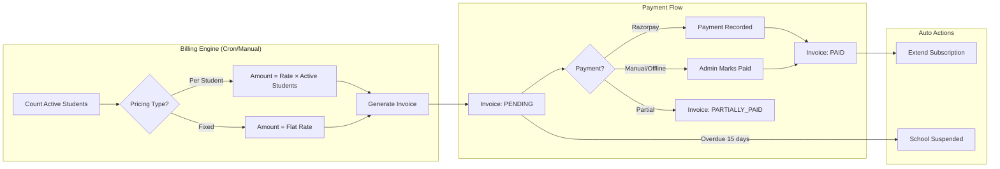

# Auto-Billing & Subscription Management System

## Overview

Build a complete billing system where Super Admin can manage school subscriptions with **auto-billing based on active student count**. Supports 4 billing cycles, invoice generation, payment tracking (paid/pending/overdue/balance), and Razorpay integration.

---

## How It Works



---

## User Review Required

> [!IMPORTANT]
> **Billing cycles expanded:** The current `subscriptions.billing_cycle` enum has only `monthly` and `yearly`. This plan adds `quarterly` and `half_yearly`. This requires a database migration (ALTER TABLE).

> [!IMPORTANT]
> **Per-student pricing rates:** Currently plans store `price_per_student_monthly` and `price_per_student_yearly`. For quarterly and half-yearly, we need to decide:
> - **Option A (Recommended):** Calculate from monthly rate — quarterly = monthly × 3, half-yearly = monthly × 6 (simple, no extra columns)
> - **Option B:** Add `price_per_student_quarterly` and `price_per_student_half_yearly` columns (more flexible but more complex)

> [!WARNING]
> **Razorpay integration:** Real Razorpay payment processing requires API keys and a verified merchant account. For now, we'll build the full flow with a **manual payment recording** option and prepare Razorpay hooks for later integration. Is this acceptable?

## Open Questions

1. **Grace period:** How many days after invoice due date before suspending a school? (Suggested: 15 days)
2. **Partial payments:** Should we allow schools to pay invoices in parts? (Suggested: Yes)
3. **Tax/GST:** Should invoices include GST (18%)? If yes, should it be included or added on top?
4. **Credit notes:** Should Super Admin be able to issue credits/discounts on invoices?
5. **Email notifications:** Should the system auto-email invoices and payment reminders to schools?

---

## Proposed Changes

### Database — New Migration

#### [NEW] [006_create_billing.sql](file:///Applications/MAMP/htdocs/FGSL/database/migrations/006_create_billing.sql)

Creates 2 new tables and modifies 2 existing ones:

**`invoices` table** — Every billing period generates an invoice
```
id, invoice_number (INV-2026-0001), school_id, subscription_id,
billing_period_start, billing_period_end, billing_cycle,
pricing_type, active_students (snapshot at billing time),
unit_price, subtotal, tax_rate, tax_amount, discount, total_amount,
amount_paid, balance_due,
status (draft/pending/paid/partially_paid/overdue/cancelled/void),
due_date, paid_at, notes,
generated_by (auto/manual), created_at
```

**`payments` table** — Tracks each payment against invoices
```
id, payment_number (PAY-2026-0001), invoice_id, school_id,
amount, payment_method (razorpay/bank_transfer/cash/cheque/upi/other),
razorpay_payment_id, razorpay_order_id, razorpay_signature,
transaction_ref, payment_date,
status (success/failed/pending/refunded),
notes, received_by (user_id), created_at
```

**ALTER `subscriptions`** — Expand billing_cycle enum
```sql
ALTER TABLE subscriptions 
MODIFY billing_cycle ENUM('monthly','quarterly','half_yearly','yearly') DEFAULT 'monthly';
```

**ALTER `plans`** — Add quarterly/half-yearly fixed prices
```sql
ALTER TABLE plans
ADD `price_quarterly` DECIMAL(10,2) DEFAULT 0.00 AFTER price_yearly,
ADD `price_half_yearly` DECIMAL(10,2) DEFAULT 0.00 AFTER price_quarterly;
```

---

### Plans Seed Update

#### [MODIFY] [plans_seed.sql](file:///Applications/MAMP/htdocs/FGSL/database/seeds/plans_seed.sql)

Add quarterly and half-yearly prices for fixed plans. Per-student plans calculate dynamically from monthly rate.

| Plan | Monthly | Quarterly | Half-Yearly | Yearly |
|---|---|---|---|---|
| Starter (fixed) | ₹1,499 | ₹4,197 (5% off) | ₹8,094 (10% off) | ₹14,990 (17% off) |
| Enterprise (fixed) | ₹9,999 | ₹28,497 (5% off) | ₹53,994 (10% off) | ₹99,990 (17% off) |
| Growth (per student) | ₹15/student | ₹15 × 3 × students | ₹15 × 6 × students | ₹150/student/yr |
| Premium (per student) | ₹10/student | ₹10 × 3 × students | ₹10 × 6 × students | ₹100/student/yr |

---

### Billing Service

#### [NEW] [BillingService.php](file:///Applications/MAMP/htdocs/FGSL/app/Services/BillingService.php)

Core billing engine with methods:

- `generateInvoice($schoolId, $subscriptionId)` — Counts active students, calculates amount, creates invoice
- `processAutoRenewal()` — Cron job: finds expiring subscriptions, generates next invoice
- `calculateAmount($plan, $billingCycle, $activeStudents)` — Price calculation logic
- `getNextInvoiceNumber()` — Auto-incrementing invoice numbers (INV-2026-0001)
- `markOverdueInvoices()` — Flags invoices past due date
- `suspendOverdueSchools($graceDays = 15)` — Suspends schools with unpaid invoices

---

### Billing Controller (Super Admin)

#### [NEW] [BillingController.php](file:///Applications/MAMP/htdocs/FGSL/app/Controllers/SuperAdmin/BillingController.php)

| Route | Method | Description |
|---|---|---|
| `GET /billing` | `index()` | Billing dashboard with revenue stats, pending/overdue summary |
| `GET /billing/invoices` | `invoices()` | All invoices list with filters (school, status, date range) |
| `GET /billing/invoices/view/{id}` | `viewInvoice()` | Single invoice detail with payment history |
| `POST /billing/invoices/generate/{school_id}` | `generateInvoice()` | Manually generate invoice for a school |
| `POST /billing/invoices/generate-all` | `generateAll()` | Bulk generate invoices for all due schools |
| `GET /billing/payments` | `payments()` | All payments list |
| `POST /billing/payments/record` | `recordPayment()` | Record manual payment against an invoice |
| `GET /billing/schools/{id}` | `schoolBilling()` | Single school's billing history (invoices + payments) |
| `POST /billing/invoices/{id}/cancel` | `cancelInvoice()` | Cancel/void an invoice |

---

### Billing Views (Super Admin)

#### [NEW] Billing Dashboard — `views/super-admin/billing/dashboard.php`
- Revenue summary cards: Total Revenue, Pending, Overdue, This Month
- Chart: Monthly revenue trend (last 12 months)
- Table: Overdue invoices requiring attention
- Quick actions: Generate invoices, view all payments

#### [NEW] Invoices List — `views/super-admin/billing/invoices.php`
- Filterable table: school, status, date range, billing cycle
- Status badges: Paid (green), Pending (yellow), Overdue (red), Partial (orange)
- Bulk actions: Generate, remind, mark paid

#### [NEW] Invoice Detail — `views/super-admin/billing/invoice-view.php`
- Invoice header: school info, invoice number, dates
- Line items: plan name, student count, unit price, subtotal
- Payment history table
- Actions: Record Payment, Send Reminder, Print/Download, Cancel

#### [NEW] Record Payment — `views/super-admin/billing/record-payment.php`
- Modal/form: amount, payment method, transaction ref, date, notes
- Partial payment support (auto-calculates balance)

#### [NEW] School Billing History — `views/super-admin/billing/school-history.php`
- Current subscription details
- Invoice timeline
- Payment history
- Balance summary

---

### Subscription Management Updates

#### [MODIFY] [school-form.php](file:///Applications/MAMP/htdocs/FGSL/views/super-admin/school-form.php)
- Add quarterly and half-yearly billing cycle options
- Update cost estimator for all 4 cycles

#### [MODIFY] [SchoolController.php](file:///Applications/MAMP/htdocs/FGSL/app/Controllers/SuperAdmin/SchoolController.php)
- Handle quarterly/half-yearly subscription creation
- Generate first invoice on school creation

#### [MODIFY] Super Admin Dashboard
- Add revenue stats: Monthly Revenue, Pending Payments, Overdue Count
- Add "Billing" link to sidebar

---

### Auto-Billing Cron Script

#### [NEW] [cron/billing.php](file:///Applications/MAMP/htdocs/FGSL/cron/billing.php)

Standalone PHP script for cron execution:

```
*/5 * * * * /usr/bin/php /path/to/FGSL/cron/billing.php >> /path/to/FGSL/storage/logs/billing.log 2>&1
```

**What it does every run:**
1. Find subscriptions expiring within 5 days with `auto_renew = 1`
2. Count each school's active students
3. Generate next-period invoice
4. Mark overdue invoices (past due_date)
5. Suspend schools with invoices overdue > 15 days
6. Log all actions

---

### Sidebar Navigation Update

#### [MODIFY] [sidebar.php](file:///Applications/MAMP/htdocs/FGSL/views/partials/sidebar.php)

Add under "Platform" section for Super Admin:
```
Billing        → /billing           (dashboard)
  └ Invoices   → /billing/invoices
  └ Payments   → /billing/payments
```

---

## Verification Plan

### Manual Verification
1. Create a school with a **per-student plan** (Growth, 300 students, monthly) → Invoice generated = ₹15 × 300 = ₹4,500
2. Create a school with a **fixed plan** (Starter, quarterly) → Invoice = ₹4,197
3. Record a **partial payment** of ₹2,000 on the ₹4,500 invoice → Status changes to "Partially Paid", balance = ₹2,500
4. Record remaining ₹2,500 → Status changes to "Paid"
5. Test **billing dashboard** shows correct totals
6. Test **manual invoice generation** for a school
7. Test **overdue marking** (change due_date to past, run cron script)

### Database Verification
```sql
-- Verify invoice amounts match plan pricing
SELECT i.invoice_number, i.active_students, i.unit_price, i.total_amount, 
       p.pricing_type, p.price_per_student_monthly
FROM invoices i 
JOIN subscriptions s ON i.subscription_id = s.id
JOIN plans p ON s.plan_id = p.id;

-- Verify payment balances
SELECT i.invoice_number, i.total_amount, i.amount_paid, i.balance_due,
       (i.total_amount - i.amount_paid) as calculated_balance
FROM invoices i;
```
