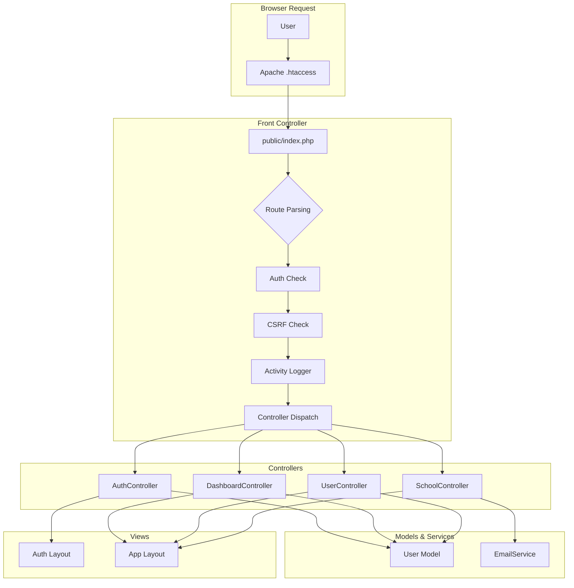

# Phase 1 — Foundation: Walkthrough

## Summary

Phase 1 of the FGSL School ERP is now complete. The foundation includes **48 files** comprising the core infrastructure, authentication system, user management, SaaS subscription model, and a premium UI design system.

---

## What Was Built

### Architecture

### Files Created (48 total)

| Category | Count | Key Files |
|---|---|---|
| **Config** | 5 | [app.php](file:///Applications/MAMP/htdocs/FGSL/config/app.php), [database.php](file:///Applications/MAMP/htdocs/FGSL/config/database.php), [mail.php](file:///Applications/MAMP/htdocs/FGSL/config/mail.php), [roles.php](file:///Applications/MAMP/htdocs/FGSL/config/roles.php), [.env](file:///Applications/MAMP/htdocs/FGSL/.env.example) |
| **Helpers** | 4 | [Database.php](file:///Applications/MAMP/htdocs/FGSL/app/Helpers/Database.php), [Session.php](file:///Applications/MAMP/htdocs/FGSL/app/Helpers/Session.php), [Validator.php](file:///Applications/MAMP/htdocs/FGSL/app/Helpers/Validator.php), [Response.php](file:///Applications/MAMP/htdocs/FGSL/app/Helpers/Response.php) |
| **Controllers** | 4 | [AuthController](file:///Applications/MAMP/htdocs/FGSL/app/Controllers/AuthController.php), [DashboardController](file:///Applications/MAMP/htdocs/FGSL/app/Controllers/DashboardController.php), [UserController](file:///Applications/MAMP/htdocs/FGSL/app/Controllers/UserController.php), [SchoolController](file:///Applications/MAMP/htdocs/FGSL/app/Controllers/SuperAdmin/SchoolController.php) |
| **Models** | 1 | [User.php](file:///Applications/MAMP/htdocs/FGSL/app/Models/User.php) |
| **Services** | 1 | [EmailService.php](file:///Applications/MAMP/htdocs/FGSL/app/Services/EmailService.php) |
| **Middleware** | 1 | [ActivityLogger.php](file:///Applications/MAMP/htdocs/FGSL/app/Middleware/ActivityLogger.php) |
| **Migrations** | 5 | Plans, Schools, Users, Roles/Permissions, Sessions/Logs |
| **Seeds** | 3 | Plans, Roles, Permissions |
| **Views** | 17 | Auth (4), Dashboard (3), Layouts (2), Partials (4), Super Admin (2), Users (2) |
| **Assets** | 3 | [style.css](file:///Applications/MAMP/htdocs/FGSL/public/assets/css/style.css), [auth.css](file:///Applications/MAMP/htdocs/FGSL/public/assets/css/auth.css), [app.js](file:///Applications/MAMP/htdocs/FGSL/public/assets/js/app.js) |
| **Router** | 2 | [index.php](file:///Applications/MAMP/htdocs/FGSL/public/index.php), .htaccess files |
| **Other** | 3 | composer.json, .gitignore, [migrate.php](file:///Applications/MAMP/htdocs/FGSL/database/migrate.php) |

---

### Database

**15 tables** created in `fgsl_erp`:

| Table | Purpose |
|---|---|
| `plans` | Subscription plans (Free, Basic, Premium, Enterprise) |
| `schools` | School profiles with branding |
| `subscriptions` | School-plan subscriptions with Razorpay fields |
| `users` | All user accounts with OTP & login tracking |
| `password_resets` | Password reset tokens |
| `roles` | 10 system roles seeded |
| `permissions` | 60+ granular permissions seeded |
| `role_permissions` | Role-permission assignments |
| `user_roles` | User-role assignments |
| `user_sessions` | Session tracking |
| `activity_logs` | Audit trail |
| `migrations` | Migration tracking |

### Key Design Decisions

1. **SaaS Multi-Tenant:** Each school has `school_id` column isolation. Super Admin manages all schools. School-level users only see their school's data.

2. **Dynamic Branding:** Each school has `primary_color`, `secondary_color`, and `logo` fields. The CSS custom property `--primary` is overridden per-school in the layout.

3. **Email OTP (no SMS):** As requested, authentication uses email-based OTP. In dev mode, the OTP is shown as a flash message. PHPMailer sends real emails in production.

4. **Front Controller Pattern:** All requests route through [public/index.php](file:///Applications/MAMP/htdocs/FGSL/public/index.php) which handles auth, CSRF, and dispatches to controllers.

5. **Premium UI:** Custom CSS design system with glassmorphism login, gradient stat cards, animated backgrounds, and responsive sidebar. No framework like Tailwind — pure CSS with custom properties.

---

## How to Test

### Login Credentials

| Account | Email | Password |
|---|---|---|
| **Super Admin** | `admin@fgsl.com` | `admin@123` |

### URLs

| Page | URL |
|---|---|
| Login | http://localhost:8888/FGSL/auth/login |
| Dashboard | http://localhost:8888/FGSL/dashboard |
| Schools | http://localhost:8888/FGSL/schools |
| Users | http://localhost:8888/FGSL/users |
| Forgot Password | http://localhost:8888/FGSL/auth/forgot-password |

### Testing Steps

1. **Open** http://localhost:8888/FGSL/auth/login
2. **Login** with `admin@fgsl.com` / `admin@123`
3. You'll see the **Super Admin Dashboard** with stat cards
4. **Navigate** to Schools → Add School (creates a new school with admin account)
5. **Navigate** to Users → Add User (creates users with role assignments)
6. **Test** Forgot Password flow → sends OTP via email (logged in dev mode)

---

## Verified

| Check | Status |
|---|---|
| Database created (`fgsl_erp`) | ✅ |
| 5 migrations executed | ✅ |
| 3 seed files (plans, roles, permissions) | ✅ |
| Super Admin account created | ✅ |
| Login page renders (HTTP 200) | ✅ |
| Dashboard redirects to login (no session) | ✅ |
| Auth protection on all routes | ✅ |

---

## Next Steps: Phase 2 — School Setup

Phase 2 will add:
- School profile editing (by School Admin on first login)
- Academic Year management
- Class → Section → Subject hierarchy
- Master data CRUD (Religion, Community, Blood Group, House, Categories)
- Holiday calendar
- Fee category setup

> [!TIP]
> Say **"Start Phase 2"** to continue building the School Setup module.
